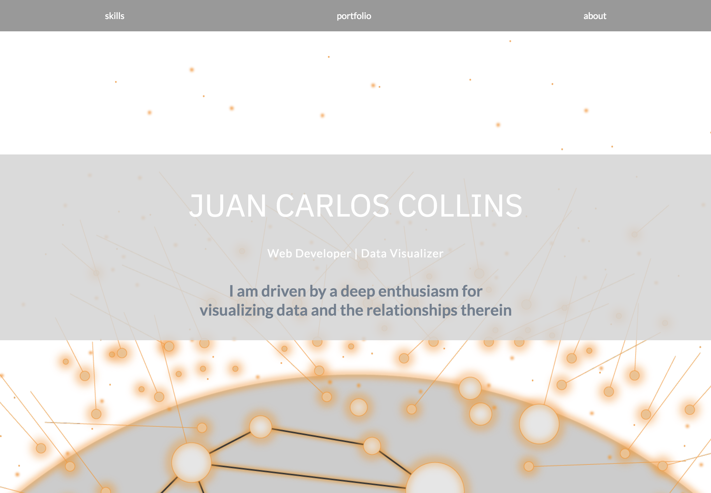

# Portfolio for Juan Carlos Collins

This my professional portfolio. It features my skills and projects.




[Live demo](https://juancarlucci.github.io/react-portfolio/)

## Process/approach:

Formulate purpose of app

Whiteboard basic concept

Create app using [React-BP](https://github.com/React-BP/SPA-portfolio) for basic structure

Create assets using Adobe Illustrator (logos for projects and landing page background)


## DELIVERABLES

### Techonolgy Stack

React.js | HTML5 | CSS3 | JavaScript | Material-UI


## Code Snippets

### Passing in data to components

#### 1. Data from javascript to state

```
projects.js

//holds array of objects for each project

...
{
    "id": 2,
    "logo": require("./images/codeinsight-logo.png"),
    "img":require("./images/codeinsight-branding.png"),
    "alt": "codeInsight app photo",
    "title": "codeInsight",
    "subtitle": "OAuth, RESTful",
    "desc": "Full-stack app to dispaly Github user statistics.",
    "features": "The main page is an insights dashboard displaying publicly available information via Github’s API. Information is displayed as graphs/charts representing major trends in the users own repo history. User can navigate to What’s Hot page for statistics for all Github repos.",
    "skills": "Backend-Node.js|MongoDb|Express. Frontend- HTML5|CSS3|JavaScrip|D3.js",
    "code": "https://github.com/juancarlucci/codeinsight",
    "site": "https://codeinsight.herokuapp.com/"
},
...

```
#### 2. Mapping over data

```
App.js

import cardData from './projects.js';

...

this.state = {
  cardData: cardData
};

...

{this.state.cardData.map(data => (
           <Card
           key={data.id}
           id={data.id}
           logo={data.logo}
           img={data.img}
           alt={data.alt}
           title={data.title}
           subtitle={data.subtitle}
           desc={data.desc}
           features={data.features}
           skills={data.skills}
           code={data.code}
           site={data.site}
           onClick={this.handleOpenModal}
           />
         ))}
```


#### 3. Data passed to individual cards

```
<Card expanded={this.state.expanded} onExpandChange={this.handleExpandChange}>
  <CardHeader
    style={{ display: "flex", alignItems: "center" }}
    title={this.props.title}
    avatar={this.props.logo}
    actAsExpander={true}
    showExpandableButton={true}
  />
  <CardMedia
    expandable={true}
    actAsExpander={true}
    overlay={<CardTitle subtitle={this.props.skills} />}
  >
    
  </CardMedia>
  <CardText expandable={true}>
    {this.props.desc}
  </CardText>
  <CardText expandable={true}>
    {this.props.features}
  </CardText>
  <CardActions>
    <FlatButton label="Live" target="_blank" href={this.props.site} />
    <FlatButton label="Code" target="_blank" href={this.props.code} />
  </CardActions>
</Card>
```

### Incorporate Material-UI


```
Card.js

import {Card, CardActions, CardHeader, CardMedia, CardTitle, CardText} from 'material-ui/Card';
import FlatButton from 'material-ui/FlatButton';

```

### Asset creation with Adobe Illustrator


